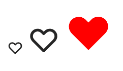

# svelte-heroicons

[](https://opensource.org/licenses/MIT)


[Svelte](https://svelte.dev/) component for [Heroicons](https://heroicons.com/).


## Install

```bash
npm i -S @martinse/svelte-heroicons
```


## Usage

```sveltehtml
<script>
	import Heroicon from 'svelte-heroicons';
	import {heart as solidHeart} from 'svelte-heroicons/dist/solid';
	import {heart as outlineHeart} from 'svelte-heroicons/dist/outline';
</script>


<Heroicon icon={outlineHeart} />
<Heroicon icon={outlineHeart} size="2em" />
<Heroicon icon={solidHeart} size="3em" class="red" />
<Heroicon icon={solidHeart} size="3em" class="red animated" />


<style>
	:global(.red) {
		color: red;
	}
</style>
```
Will render:




## Build / development
In order to build new versions of this package, there some prerequisites 
to be installed, and some commands to execute. The build process is executed 
within a Docker container.


### Prerequisites
- [Docker](https://www.docker.com/)
- [Taskfile](https://taskfile.dev/)

### Building the Docker container
```shell
task build
```


### Building the package
Building the package is composed of two stes:

1. Download and generate icon data from a specific Heroicons version
2. Build the NPM package

```shell
task generate-icon-data
task build-npm-dist
```

### Publish to NPM
- Update the version in `package.json`
- Tag and push to GitHub
- Publish to NPM:
```shell
task publish
```

## Update Heroicons version
Update the `HEROICONS_VERSION` variable in `Taskfile.yml` and rebuild the 
Docker container + build/publish the NPM package. 


## Improvements
* [ ] Avoid the `/dist` path when importing solid our outline
* [ ] Add tests
* [ ] Create a proper demo page + figure out how to publish a Svelte app to GitHub pages.
* [ ] Probably a lot more, feel free to create issues on what can be improved!


## License
[MIT](LICENSE.md)
